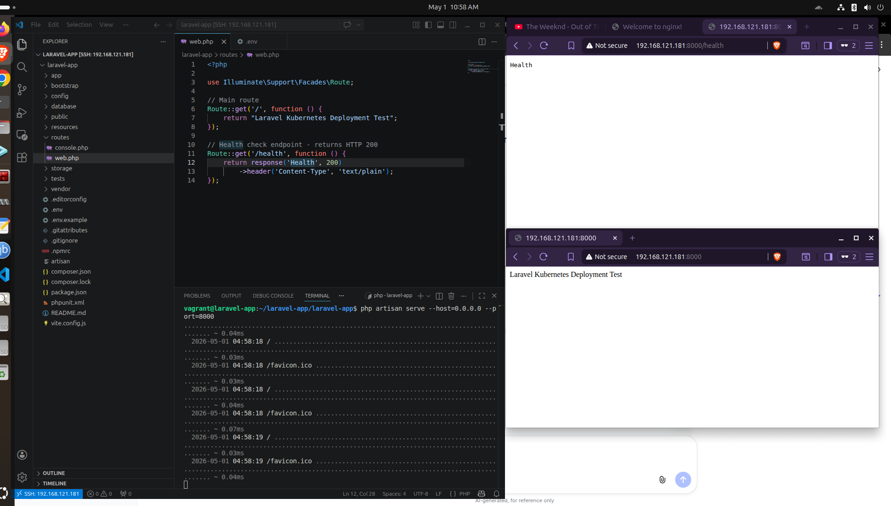

## Gole of Task
```bash
/ → returns text
/health → returns HTTP 200
```

### Prerequisites
```bash
Before running this project, ensure you have the following installed:

PHP >= 8.3
Composer (latest version)
Laravel (13)
Git
Curl (for testing endpoints)
```

#### Step 1: Create Laravel Project
```bash
composer create-project laravel/laravel laravel-app "^13.0"
cd laravel-app
```

#### Step 2: Add Routes

Open this file
```bash
routes/web.php
```
Replace or add
```bash
<?php

use Illuminate\Support\Facades\Route;

Route::get('/', function () {
    return "Laravel Kubernetes Deployment Test";
});

Route::get('/health', function () {
    return response()->json(['status' => 'ok'], 200);
});
```

**As this project does not require Redis or database-backed session storage, Laravel is configured to use the file session driver for simplicity**
```
go to .env
and change SESSION_DRIVER=database to SESSION_DRIVER=file
```

#### Step 3: Run Laravel
```bash
php artisan serve --host=0.0.0.0 --port=8000
```

#### Step 4: Test (VERY IMPORTANT for proof)
 **Go to browser and hit the url**
 ```bash
 http://192.168.121.181:8000/
 http://192.168.121.181:8000/health
 ```
 Expected
 ```bash
 Laravel Kubernetes Deployment Test
 Health
 ```
#### Screenshot (visual proof)




