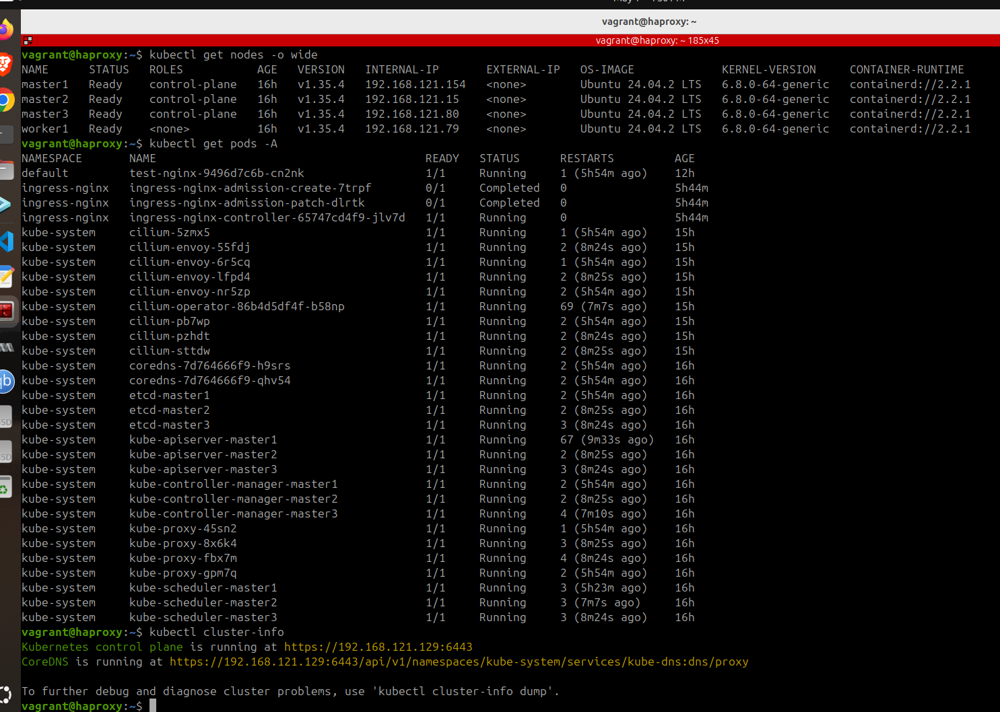

# Kubernetes 1.35 HA Cluster Setup with HAProxy and Cilium

### Architecture Overview
```bash
Node	    IP Address	        Role
-------------------------------------------------
master1	    192.168.121.154	    Control Plane
master2	    192.168.121.15	    Control Plane
master3	    192.168.121.80	    Control Plane
worker1	    192.168.121.79	    Worker
hpa	        192.168.121.129	    Load Balancer
-------------------------------------------------
```

## Part-1: Common Setup (master1,master2,master3,worker1) <br>

#### Step 1: Hostname Setup (Optional but Recommended)
```bash
sudo hostnamectl set-hostname master1    # or master2, master3, worker1, hpa

# Verify
hostnamectl
```
#### step 2: Disable Swap
```bash
# Disable swap immediately
sudo swapoff -a

# Disable swap permanently
sudo sed -i '/ swap / s/^\(.*\)$/#\1/g' /etc/fstab

# Verify swap is disabled
free -h
```
#### step 3: Configure Kernel Modules and System Settings
```bash
# Make kernel modules persistent
cat <<EOF | sudo tee /etc/modules-load.d/k8s.conf
overlay
br_netfilter
EOF

# Load required kernel modules
sudo modprobe overlay
sudo modprobe br_netfilter

# Configure sysctl parameters
cat <<EOF | sudo tee /etc/sysctl.d/k8s.conf
net.bridge.bridge-nf-call-iptables  = 1
net.bridge.bridge-nf-call-ip6tables = 1
net.ipv4.ip_forward                 = 1
EOF

# Apply sysctl settings
sudo sysctl --system
sudo sysctl -w net.ipv4.ip_forward=1
```
### step 4: Verify Kernel Modules and IP Forwarding
```bash
lsmod | grep br_netfilter
sysctl net.ipv4.ip_forward

# If the value is 1 for net.ipv4.ip_forward then ok
```
#### step 5:  Install Container Runtime (Containerd)
```bash
# Update system packages
sudo apt update && sudo apt upgrade -y

# Install containerd
sudo apt install -y containerd

# Create containerd configuration
sudo mkdir -p /etc/containerd
containerd config default \
| sed 's/SystemdCgroup = false/SystemdCgroup = true/' \
| sed 's|sandbox_image = ".*"|sandbox_image = "registry.k8s.io/pause:3.10"|' \
| sudo tee /etc/containerd/config.toml > /dev/null

# Restart and enable containerd
sudo systemctl restart containerd
sudo systemctl enable containerd
```
#### step 6: Kubernetes Repository
```bash
# Install necessary packages
sudo apt update
sudo apt-get install -y apt-transport-https ca-certificates curl gpg

# Create GPG keyrings directory
sudo mkdir -p /etc/apt/keyrings

# Add Kubernetes GPG key and repository for v1.35
sudo rm -f /etc/apt/keyrings/kubernetes-apt-keyring.gpg
curl -fsSL https://pkgs.k8s.io/core:/stable:/v1.35/deb/Release.key | sudo gpg --dearmor -o /etc/apt/keyrings/kubernetes-apt-keyring.gpg
sudo chmod 644 /etc/apt/keyrings/kubernetes-apt-keyring.gpg

echo 'deb [signed-by=/etc/apt/keyrings/kubernetes-apt-keyring.gpg] https://pkgs.k8s.io/core:/stable:/v1.35/deb/ /' | sudo tee /etc/apt/sources.list.d/kubernetes.list

# Update package list to recognize the new version
sudo apt update

# Verify kubernetes repo
cat /etc/apt/sources.list.d/kubernetes.list
```

#### step 7: Install kubeadm, kubelet, and kubectl
```bash
# Update package index and install Kubernetes components
sudo apt update
sudo apt install -y kubelet kubeadm kubectl

# Prevent automatic updates
sudo apt-mark hold kubelet kubeadm kubectl

# Enable kubelet
sudo systemctl enable kubelet
```

## Part-2 : Master Node Setup - Initialize Cluster <br>

#### part 8: Initialize the Cluster (on master1 Only)
```bash
# Find your master node IP address
ip addr show

# Initialize the cluster with HAProxy endpoint
sudo kubeadm init \
  --control-plane-endpoint "<HAProxy-IP>:6443" \
  --upload-certs \
  --pod-network-cidr=10.10.0.0/16
```
**<span style="color:red">CRITICAL</span>: Save the kubeadm join command from the output! You'll need it for master2, master3, and worker1.** 

**If Certificate Key Doesn't Appear (Manual Fix)** <br>
If the --certificate-key doesn't appear in the output, generate it manually. 
```bash
sudo kubeadm init phase upload-certs --upload-certs
``` 

**Expected Output Example**
```bash
sudo kubeadm join <HAproxy-ip>:6443 \
  --token ******#####@@@@&&&&* \
  --discovery-token-ca-cert-hash sha256:-----####*********@@@@@@@ \
  --control-plane \
  --certificate-key *****************@@@@@@@@@@@################
  ```

  #### step 9 : Configure kubectl Access (on master1)
```bash
# Setup kubectl configuration
mkdir -p $HOME/.kube
sudo cp -i /etc/kubernetes/admin.conf $HOME/.kube/config
sudo chown $(id -u):$(id -g) $HOME/.kube/config

# Test access
kubectl get nodes
```

#### Step 10: Join Additional Control Plane Nodes (master2 & master3) 

 On master2 and master3, run the join command with --control-plane flag 
 ```bash
 sudo kubeadm join <HAproxy-ip>:6443 \
  --token ******#####@@@@&&&&* \
  --discovery-token-ca-cert-hash sha256:-----####*********@@@@@@@ \
  --control-plane \
  --certificate-key *****************@@@@@@@@@@@################
  ```

  Configure kubectl on master2 and master3

```bash
mkdir -p $HOME/.kube
sudo cp -i /etc/kubernetes/admin.conf $HOME/.kube/config
sudo chown $(id -u):$(id -g) $HOME/.kube/config
```

#### Step 11: Join Worker Node (worker1)

On worker1, run the join command **without --control-plane** flag

```bash
 sudo kubeadm join <HAproxy-ip>:6443 \
  --token ******#####@@@@&&&&* \
  --discovery-token-ca-cert-hash sha256:-----####*********@@@@@@@
  ```

  ## Part-3: HAProxy Node Setup (hpa Only)

  #### Step 12: Install and Configure HAProxy
  **12.1 Install HAProxy**
  ```bash
  sudo apt update
  sudo apt install -y haproxy
```

**12.2 Configure HAProxy**
Edit /etc/haproxy/haproxy.cfg
```bash
sudo vim /etc/haproxy/haproxy.cfg
```

Add the following configuration 
```bash
global
    log /dev/log local0
    log /dev/log local1 notice
    chroot /var/lib/haproxy
    stats socket /run/haproxy/admin.sock mode 660 level admin
    stats timeout 30s
    user haproxy
    group haproxy
    daemon

defaults
    log global
    mode http
    option httplog
    option dontlognull
    timeout connect 5000
    timeout client 50000
    timeout server 50000

frontend kubernetes-frontend
    bind *:6443
    mode tcp
    option tcplog
    default_backend kubernetes-backend

backend kubernetes-backend
    mode tcp
    option tcp-check
    balance roundrobin
    server master1 192.168.121.154:6443 check
    server master2 192.168.121.15:6443 check
    server master3 192.168.121.80:6443 check
```

**12.3 Start HAProxy**
```bash
# Validate configuration
sudo haproxy -f /etc/haproxy/haproxy.cfg -c

# Restart and enable HAProxy
sudo systemctl restart haproxy
sudo systemctl enable haproxy

# Verify HAProxy is running
sudo systemctl status haproxy
sudo ss -tulpn | grep 6443
```
**12.4 Install kubectl on HAProxy Node (For Cluster Management)**


## Part-4: Install Cilium CNI Plugin
```bash
# Cilium CLI version find out and download it.
CILIUM_CLI_VERSION=$(curl -s https://raw.githubusercontent.com/cilium/cilium-cli/main/stable.txt)
CLI_ARCH=amd64
if [ "$(uname -m)" = "aarch64" ]; then CLI_ARCH=arm64; fi

curl -L --fail --remote-name-all https://github.com/cilium/cilium-cli/releases/download/${CILIUM_CLI_VERSION}/cilium-linux-${CLI_ARCH}.tar.gz{,.sha256sum}
sha256sum --check cilium-linux-${CLI_ARCH}.tar.gz.sha256sum
sudo tar -xzvf cilium-linux-${CLI_ARCH}.tar.gz -C /usr/local/bin
rm cilium-linux-${CLI_ARCH}.tar.gz{,.sha256sum}

# Cilium version check
cilium version

# Cilium install with appropiate version.
cilium install --version v1.18.1 #choose from the last command (cilium version)_

# Status check
cilium status
```
**It will take some time to install cilium.**

#### If resources are limited, then allow scheduling on the master node (optional).
```bash
# Remove taint to allow pod scheduling on master nodes
kubectl taint nodes --all node-role.kubernetes.io/control-plane-
```

## Part-5 :Configure HAProxy Node for Cluster Management

#### step 13: Copy kubeconfig from master1 to hpa

**On master1**
```bash
# Make admin.conf readable for copying
sudo cp /etc/kubernetes/admin.conf /tmp/admin.conf
sudo chmod 644 /tmp/admin.conf
```
**On hpa (HAProxy node)**
```bash
# Create .kube directory
mkdir -p $HOME/.kube

# Copy kubeconfig from master1
scp vagrant@192.168.121.154:/tmp/admin.conf $HOME/.kube/config

# Verify cluster access
kubectl get nodes
```
**Expected  Output **

```bash
NAME      STATUS     ROLES           AGE     VERSION
master1   Ready      control-plane   5m      v1.35.0
master2   Ready      control-plane   3m      v1.35.0
master3   Ready      control-plane   2m      v1.35.0
worker1   Ready      <none>          1m      v1.35.0
```

## Part-6: Verification
#### Step 14: Verify Cluster Status
```bash
# Check all nodes are ready
kubectl get nodes -o wide

# Check all system pods are running
kubectl get pods --all-namespaces

# Check Cilium status
cilium status --wait
kubectl -n kube-system exec ds/cilium -- cilium status

# Verify HAProxy load balancing
curl -k https://192.168.121.129:6443/version
```
#### Step 15: Test with Sample Application

```bash
# Check all nodes are ready
kubectl get nodes

# Check all system pods are running
kubectl get pods --all-namespaces

# Test with sample application
kubectl create deployment test-nginx --image=nginx
kubectl get pods

#expose the port 
kubectl expose deployment test-nginx --port=80 --target-port=80 --type=NodePort

# Clean up test
kubectl delete deployment test-nginx

kubectl delete svc test-nginx
```

## Cluster information (Proof)
